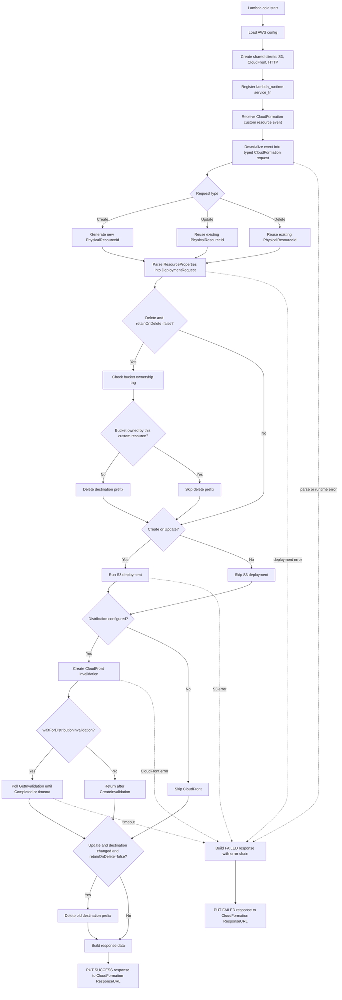
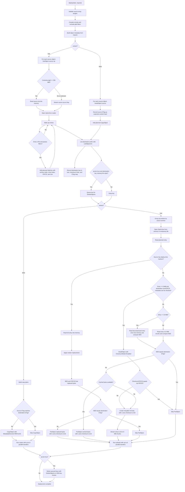
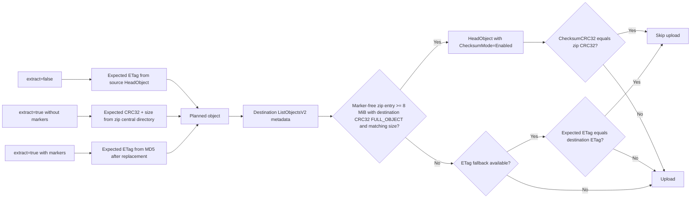
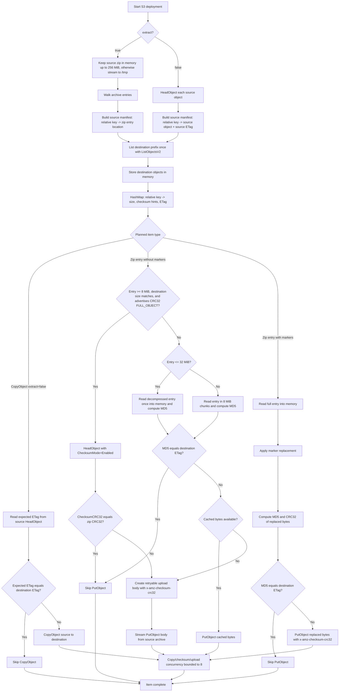

# Lambda Workflow

This document shows the current runtime workflow for the `RustBucketDeployment` provider Lambda.

## GitHub Theme Support

The diagrams below use GitHub-flavored Markdown Mermaid code blocks instead of static images, so GitHub renders them in the viewer's current light or dark theme. If these diagrams are ever exported to image files, use GitHub's theme-aware `<picture>` pattern:

```html
<picture>
  <source media="(prefers-color-scheme: dark)" srcset="diagram-dark.png">
  <source media="(prefers-color-scheme: light)" srcset="diagram-light.png">
  
</picture>
```

## Handler Overview



## S3 Deployment Workflow



## Skip Decision Path



## File Upload Handling

The destination objects are listed once per deployment after the source plan is built. Key, size, checksum algorithm/type, and `ETag` metadata are stored in memory as a key-to-metadata map, not as upload payloads.



For plain zip entries, the handler prefers zip CRC32 plus uncompressed size against S3 full-object CRC32 metadata only for entries at least 8 MiB. When that is available, unchanged entries are skipped without decompressing the entry. Smaller entries and entries without usable checksum metadata fall back to MD5 and compare against the destination ETag map. Fallback entries up to 32 MiB are cached after decompression so changed entries can upload those same bytes; larger entries keep the streaming 8 MiB chunk path. Checksum reads, fallback hashing, and uploads run inside the bounded transfer task pool.

## Current Runtime Notes

- Source zip archives are kept in memory when S3 reports `ContentLength <= 256 MiB`; larger or unknown-size archives are streamed to temporary files in Lambda `/tmp`.
- Plain zip entries at least 8 MiB use zip CRC32 and S3 checksum metadata when available. If changed, the upload stream reopens the entry from the retained source archive and sends one 8 MiB chunk at a time with `x-amz-checksum-crc32`.
- In the MD5 fallback path, decompressed entries up to 32 MiB are cached and uploaded from those cached bytes if changed; larger entries are streamed for hashing and streamed again only if upload is needed.
- The upload stream is retryable because the body can be rebuilt from the retained in-memory or temporary source archive.
- Zip entries with deploy-time replacements are still fully materialized in memory after replacement, because the final bytes must be known before computing the ETag/CRC32 and uploading.
- The handler does not extract the archive to disk and does not stage individual zip entries in `/tmp`.
- Copy, checksum read, fallback hash, and upload work is bounded by `MAX_PARALLEL_TRANSFERS = 8`.
- `prune=true` lists the destination prefix and deletes destination objects that are not in the planned source set.
- CloudFront invalidation is created after S3 deployment or delete handling; if waiting is enabled, the handler polls until completion or timeout.

## Memory Budget

The construct default is `DEFAULT_MEMORY_LIMIT_MB = 1024`. The current Rust constants are budgeted against that 1 GiB Lambda size:

```text
peak ~= runtime_reserve
      + MEMORY_ARCHIVE_THRESHOLD_BYTES
      + MAX_PARALLEL_TRANSFERS
        * (ZIP_ENTRY_READ_CHUNK_BYTES
           + DECOMPRESSED_ENTRY_CACHE_THRESHOLD_BYTES
           + sdk_http_overhead)
      + safety_margin

941 MiB ~= 205 MiB
        + 256 MiB
        + 8 * (8 MiB + 32 MiB + 4 MiB)
        + 128 MiB
```

`runtime_reserve` is estimated as roughly 20% of the Lambda memory for AL2023, the Rust runtime, SDK clients, allocator behavior, and process overhead. `sdk_http_overhead` is an estimate for per-transfer SDK/body/http buffering. The 128 MiB safety margin covers variance, destination metadata maps, futures, logging, and smaller temporary allocations. These are not hard AWS guarantees; they are the sizing assumptions behind keeping `MEMORY_ARCHIVE_THRESHOLD_BYTES` at 256 MiB and `DECOMPRESSED_ENTRY_CACHE_THRESHOLD_BYTES` at 32 MiB with eight concurrent transfers.

`REMOTE_CHECKSUM_MIN_BYTES = 8 MiB` is separate from the memory budget. It reflects the benchmark result that checksum-mode `HeadObject` is slower than local MD5 for small files while S3 `ListObjectsV2` exposes checksum presence but not the actual CRC32 value. If S3 starts returning actual CRC32 values in `ListObjectsV2`, the local-MD5 threshold should be removed because no extra API call would be needed for CRC32 comparisons.
